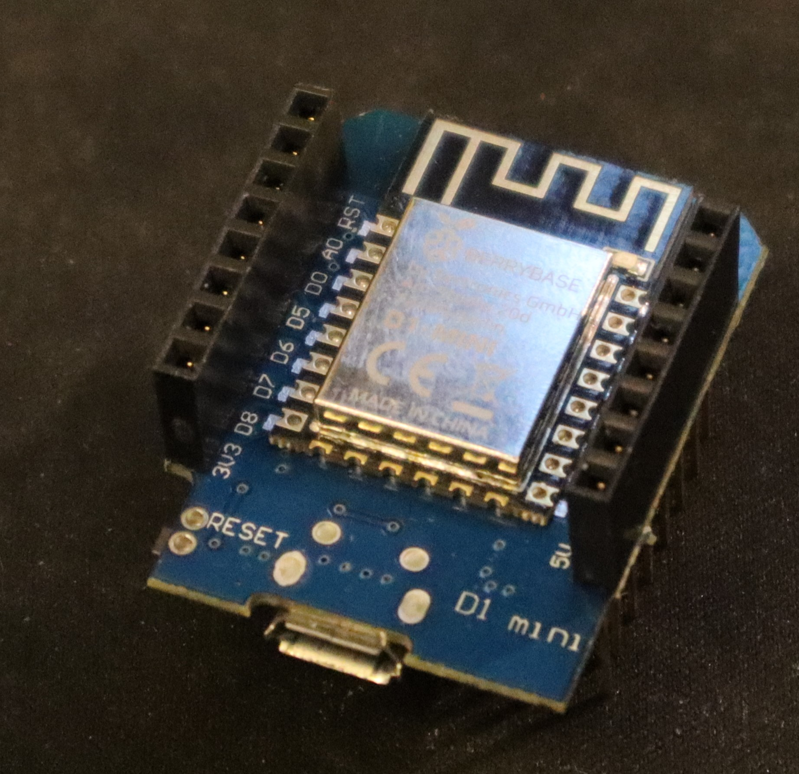
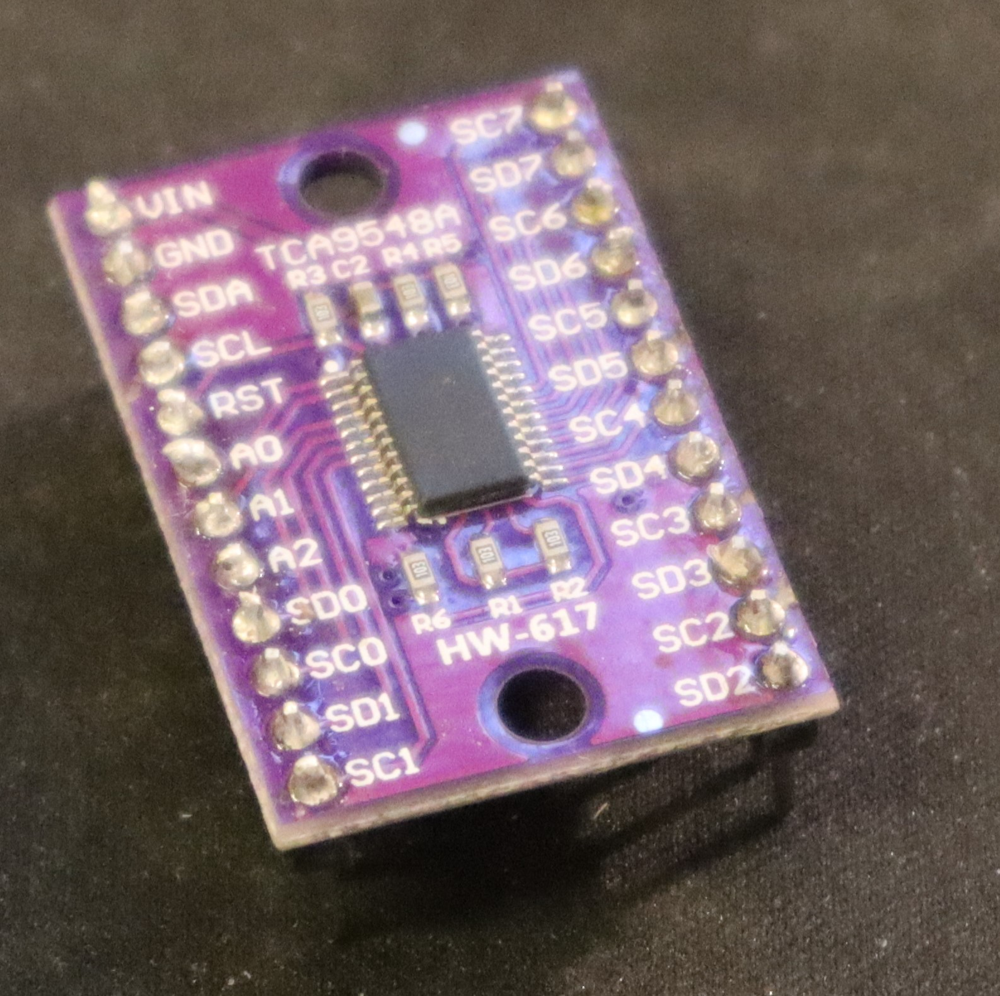
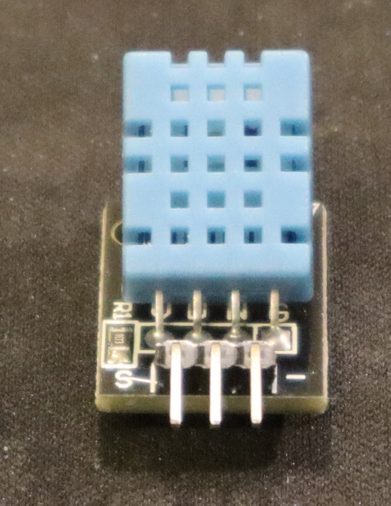
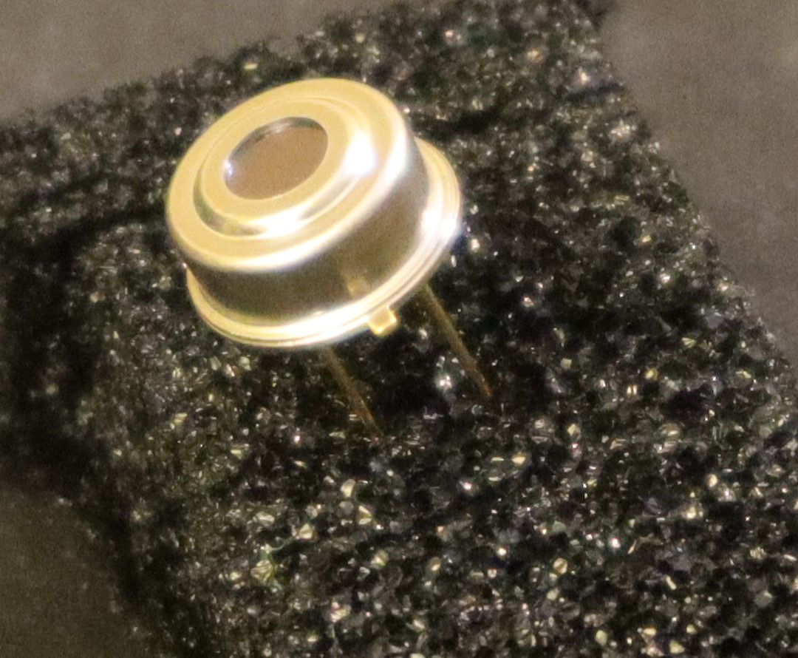
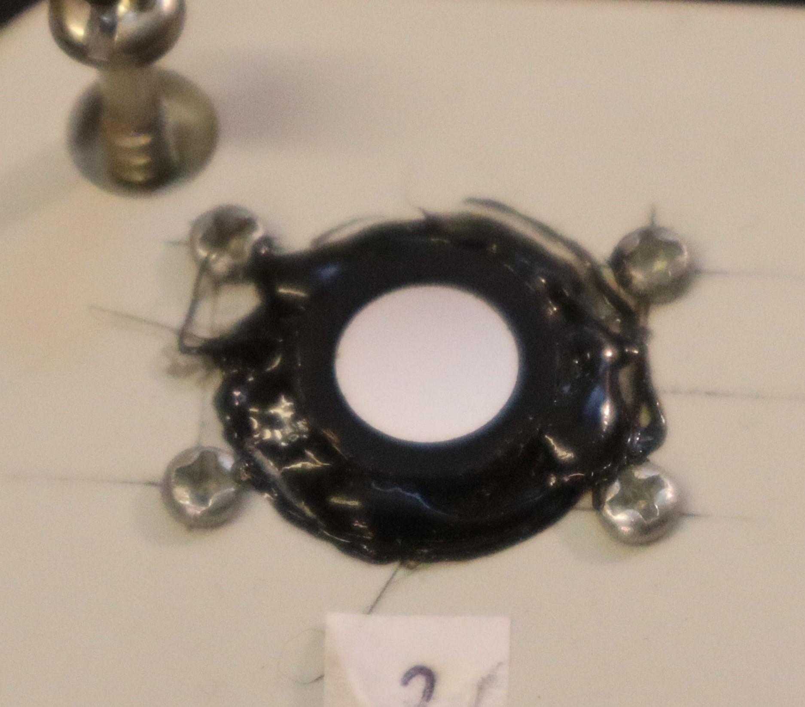
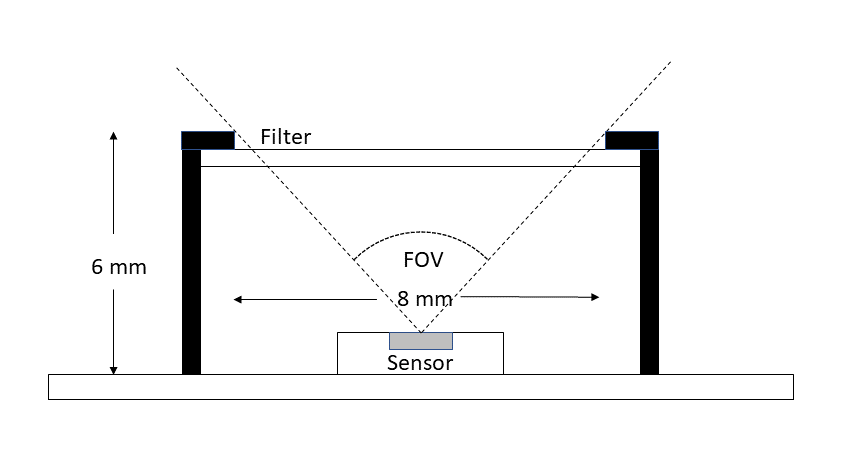

# Aurora-project-detector
Aurora is a light phenomenon in the night sky that fascinates many people. This project has aimed to develop a detector that can send alerts to users and tell whether or not there is an aurora event. Many want to see the aurora, but not as many want to stay up all night to have the chance to see them. 
By using a multi-layer interference filter in front of a photodiode on a single Complementary metal-oxide-semiconductor, CMOS, available on the market, I have managed to produce a detector that gives promising results regarding the ability to at least distinguish intense aurora events. 
# Electrical components
# Microcontroller
WEMOS D1 MINI

# Light sensors TSL2591
The TSL2591 is a sensor with a photodiode on an integrated circuit from AMS. Available on a development break-out board from Adafruit.
Two sensors were appplied. One with a interferense filter in front of and one without.

There is an green led on the board that I coverd with black melting glue.
# Multiplexer TCA9548A
The light sensors have same I2C address which means that a mutiplexer is needed in order to distribute the signals to the light sensors.

# Cloud detector
In order to get rid of artificial light, reflected in the clouds, a cloud detector was implemented. 
Consists of a MLX90614, infrared thermometer and a DHT11, humidity sensor, was used.

# Optical components
# Multy-layer interference filter
To filter out the green, 557 nm light, a multi-layer interference filter with a 10 nm bandwidth centered at 557 nm was used. 

